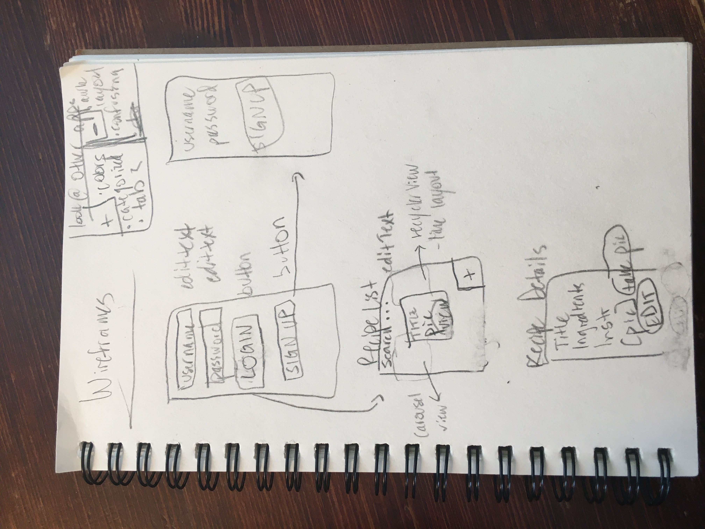

Original App Design Project - README Template
===

# Recipe Storage

## Table of Contents
1. [Overview](#Overview)
1. [Product Spec](#Product-Spec)
1. [Wireframes](#Wireframes)
2. [Schema](#Schema)

## Overview
### Description
A mobile Android app developed in Java. Users can create profiles and store recipes. 

### App Evaluation
- **Category:** Food & Drink
- **Mobile:** Only available on mobile
- **Story:** Store links or descriptions of recipes you’ve liked along with pictures about how they turned out and notes about how to improve the recipe next time.
- **Market:** People who like to cook (especially using recipes from the Internet, not from physical books) and want to organize their recipes
- **Habit:** After cooking or baking something from a recipe, users record the recipe in the app.
- **Scope:** Use camera feature to take pictures, incorporate an SDK somehow

## Product Spec

### 1. User Stories (Required and Optional)

**Required Must-have Stories**

* Log in/log out of app as a user *(FBU requirement)*
* Can sign up with new user profile *(FBU requirement)*
* Can add new recipe w/ recipe ingredients, instructions, notes, prep/cook time
* Can delete recipe
* Can edit recipe
* Store at least 5 most recent recipes when user logs out using Parse *(FBU requirement: interact with a database)*
* Can take photo of what you've made and record alongside recipe *(FBU requirement: use camera)*
* [Facebook SDK](https://developers.facebook.com/docs/android/), maybe for logging in or sharing *(FBU requirement: SDK)*
* Sort OR search for recipes somehow *(FBU requirement: complex algorithm)*
* double tap to favorite *(FBU requirement: gesture recognizer)*
* animation *(FBU requirement)*
* uses an external library (eg Glide) [(more ideas)](https://medium.com/better-programming/30-best-android-libraries-and-projects-of-2019-a1e35124f110) *(FBU requirement)*

**Optional Nice-to-have Stories**

* add option to write down notes about recipe
* integrate [Spoonacular API](https://spoonacular.com/food-api) (maybe recommend recipes or pull recipes directly from Spoonacular)
* use 

### 2. Screen Archetypes

* Opening screen: Login/Sign up screen
   * requirement: log in
   * requirement: Facebook SDK

* Sign up screen
    * requirement: sign up

* Home: recipe list
   * requirement: Sort OR search for recipes at top of screen
   * requirement: add recipe button at bottom
   * requirement: delete recipe button at bottom
   * requirement: Store at least 5 most recent recipes when user logs out using Parse
   * requirement: double tap to favorite
   * requirement: animation
   * requirement: external library

* Recipe details
    * requirement: Can edit recipe

* Camera
    * requirement: Can take photo of what you've made and record alongside recipe

### 3. Navigation

**Tab Navigation** (Tab to Screen)

* N/A (for now)

**Flow Navigation** (Screen to Screen)

* Login/Sign up Screen
=> Home: recipe list
=> Registration Screen

* Registration Screen
=> Home: recipe list

* Home: recipe list
=> recipe details

* Recipe details
=> Camera 

## Wireframes

### [BONUS] Digital Wireframes & Mockups

### [BONUS] Interactive Prototype

## Schema 
### Models

**User**
|     **Property**   |        **Type**      |           **Description**  | **Required for MVP?** |   |
|:---------------:|:-----------------:|:--------------------------------:|-------------------|---|
| User            | User              | who uploaded the recipe          | X                 |   |
| username        | String            |                                  | X                 |   |
| password        | String            |                                  | X                 |   |
| recipes         | ArrayList<Recipe> | recipes the user has uploaded    | X                 |   |

**Recipe**
|     **Property**    |        **Type**       |     **Description**        | **Required for MVP** |   |
|:---------------:|:-----------------:|:------------------------------------:|-------------------|---|
| title           | String            |                                      | X                 |   |
| ingredients     | ArrayList<String> | recipe ingredients                   | X                 |   |
| instructions    | ArrayList<String> | recipe instructions                  | X                 |   |
| CookTimeMinutes | unsigned int      | how long it takes to make the recipe | X                 |   |
| recipeImage     | ParseFile         | image of the recipe                  | X                 |   |
| Notes           | ArrayList<String> | recipe notes                         |                   |   |
| usersSharedWith | ArrayList<User>   | users that have access to recipe     |                   |   |
| isFavorite      | Boolean           |                                      |                   |   |
| recipeCategory  | String            | eg breakfast, dinner                 |                   |   |
  
  
  
### Networking
- Opening screen: Login screen
    * (GET) username
    * (GET) password
- Sign up screen
    * (POST) username
    * (POST) password
- Home: recipe list
    * (GET/POST/UPDATE) isFavorite
- Recipe details
    * (GET/POST/UPDATE/DELETE) Title
    * (GET/POST/UPDATE/DELETE) Ingredients
    * (GET/POST/UPDATE/DELETE)Instructions
    * (GET/POST/UPDATE/DELETE)Cook time (min)
    * (GET/POST/UPDATE/DELETE) Notes
    * (GET/POST/UPDATE/DELETE) recipeImage
    * (GET/POST/UPDATE) isFavorite
    * (GET/POST/UPDATE) Recipe category
    * (GET/POST/UPDATE/DELETE) usersSharedWith
    

- basic snippets for each Parse network request
  // GET
  
  let query = PFQuery(className:"Recipe")
  query.whereKey("user", equalTo: currentUser)
  query.order(byDescending: "createdAt")
  query.findObjectsInBackground { (posts: [PFObject]?, error: Error?) in
     if let error = error { 
        print(error.localizedDescription)
     } else if let recipes = recipes {
        print("Successfully retrieved \(recipes.count) recipes.")
    // TODO: Do something with recipes...
     }
  }
  
  // DELETE ([source](https://stackoverflow.com/questions/26208937/delete-specific-object-from-parse-com#:~:text=3%20Answers&text=However%2C%20if%20you%20want%20to,the%20destroy%20method%20of%20ParseObject))
  
  func delete(imageId: String) {

    let query = PFQuery(className: "Recipe")
    query.whereKey("Ingredients", equalTo: "\(ingredients)")

    query.findObjectsInBackground {
        (objects:[PFObject]?, error: Error?) -> Void in

        if error == nil && (objects != nil) {
            for object in objects! {
                object.deleteInBackground()
                print("object deleted")
            }
        }
    }
}
  

- [OPTIONAL: List endpoints if using existing API such as Yelp]
